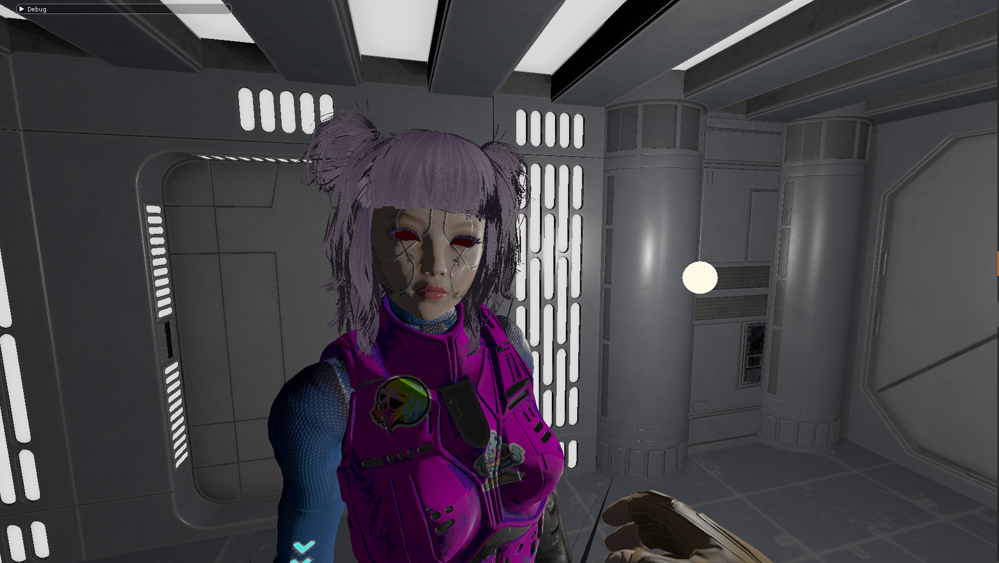

# not-TitanFall3

Just like the title suggests, this is not TitanFall 3, but an OpenGL renderer in C++.

[Demo Video || YouTube](https://youtu.be/W88HXR9QiLM)



## Features

- Physically based shading
- Compute Shader Ray Tracing (Checkout [Controls Section](#controls))
- IBL using reflection probes
- Terrain Generation using tesselation shaders and heightmaps
- Directional and point lights
- Shadows
- Cascaded shadow mapping
- Fogs/Clouds rendering using Ray Marching
- Model Loading (gltf, obj) with animations
- Instanced rendering
- HDR, Bloom

## How to BUILD and RUN

Clone the project using

```git
git clone --recurse-submodules https://github.com/Shaurya-Ps-Bisht/not-TitanFall3.git
```

Since one of the library is added as a submodule (I just wanted to try it out :/)

### Windows

- Use CMake to generate the visual studio solution, I used the cmake GUI for this one.

  - Choose the source code location to be the root of the project.
  - Create a new directory in the root and choose that to be the build/binary directory.
  - Configure and then Generate, default options work for VS2022.

- Enter Visual Studio
  - Choose "engine" as the Startup Project by right-clicking on it in the Solution explorer.
  - Build the solution or just "engine".

### Linux

- Generate a single config (Debug only) or mutli config make, I used Ninja to generate a multi-config make using:
  ```make
  cmake -S . -B build -G "Ninja Multi-Config"
  cmake --build build --config Debug
  ```
- The second command generates a binary in Debug mode, you can change it to Release.
- The binary/executable will be located in /bin/Debug or /bin/Release.

**_NOTE_**:

- Seems like making the app use the dedicated GPU on Linux isn't as simple as putting a macro like Windows. So the app will run on your iGPU by default, you can implement your own workaround here based on your system.
- The glfw Window might not open on Wayland sessions but should on X11.

## Controls

- Player Movement
  - Strafe Left/Right - A / D
  - Move Forward/Backward - W / S
  - Move Camera - Mouse controlled
- Others
  - U - Enable Cursor
  - N - Change Cascade level (if viewing the texture)
  - L - Wireframe view (Currently bugged due to Bloom and rendering to custom framebuffer)
- Raytracing
  - In Renderer.h line 36, set `RayTracing` to true if you want to run the Compute Shader based Ray Tracer.


## To Do

- [ ] Shader code modularity
- [ ] Directional Light: Float Textbox -> Slider and CSM solution.
- [ ] resolve model loading missing weights and size difference (animated vs still)
- [ ] Wireframe View with custom framebuffer
- [ ] Debounce for general keys
- [ ] nvim-dap and nvidia-prime integration (Not running with prime-run on Wayland (Hyprland, Plasma) but works fine with x11.)
- [ ] Material Class
- [ ] GPU bottleneck
- [ ] MetallicRoughness combined in gltf improvement
- [ ] Depth pass for instanced objects, animations and terrain
- [ ] Point light shadows performance(Bounding Volume and non-moving objects)
- [ ] Spotlights
- [ ] Reflection Probes
- [ ] OIT
- [ ] Proper material/texture access in model class
- [ ] Direct State Access
- [x] Frustum Culling: Grass and Terrain
- [ ] AABB: Precalculate the Convex-Hull of objects to calculate AABBs (it's faster)
- [ ] FOV and frustum culling bugs

###### God bless RenderDoc
